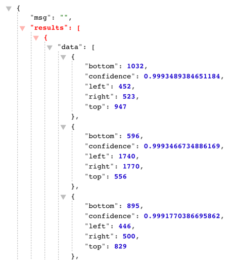

# 基于 Serverless 人脸关键点检测

大家可以通过本项目提供的镜像，快速发布成可调用的Restful API服务。

## 一、模型基本信息

- ### 应用效果展示


- ### 模型介绍

PyramidBox-Lite是基于2018年百度发表于计算机视觉顶级会议ECCV 2018的论文PyramidBox而研发的轻量级模型，模型基于主干网络FaceBoxes，对于光照、口罩遮挡、表情变化、尺度变化等常见问题具有很强的鲁棒性。该PaddleHub Module是针对于移动端优化过的模型，适合部署于移动端或者边缘检测等算力受限的设备上，并基于WIDER FACE数据集和百度自采人脸数据集进行训练，支持预测，可用于人脸检测。

# 部署方法

# 1. 在阿里云函数计算应用中心里立即创建

[阿里云Serverless 应用中心一键体验 ](https://fcnext.console.aliyun.com/applications/create?template=paddlePyramidBox)

# 2. 终端上输入命令创建

```shell

s init paddlePyramidBox  # 初始化项目
s deploy  # 部署项目

```

# 调用方法

```python
import requests
import json
import cv2
import base64


def cv2_to_base64(image):
    data = cv2.imencode('.jpg', image)[1]
    return base64.b64encode(data.tostring()).decode('utf8')


def getResult(imagePath):
    data = json.dumps({'images': [cv2_to_base64(cv2.imread(imagePath))]})
    r = requests.post("http://127.0.0.1:9000/predict/pyramidbox_lite_mobile", data=data,
                      headers={'Content-Type': 'application/json'})
    return r.json()["results"]


print(getResult("./test.png"))
```

# 本应用的镜像开发教程

https://github.com/duolabmeng6/paddlehub_ppocr

阅读本文你将学会：

在 Serverless 架构中 docker 镜像制作的最佳实践，游刃有余的部署复杂场景下的深度学习模型

熟练的使用各厂商提供的 Serverless 服务，部署。

制作小巧精良的 docker 镜像

# 常用命令
```shell
s cli registry login # 登录授权 一次就行
s cli registry publish # 发布包
s cli registry list # 查看子机已发布的包

s init paddlePyramidBox # 自己测试应用的效果
s deploy # 部署项目试试
```